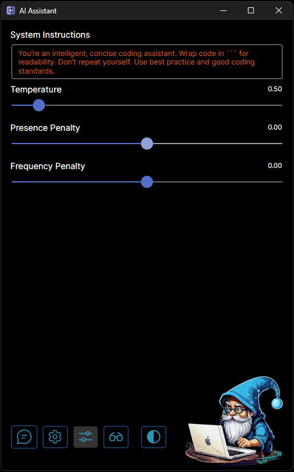
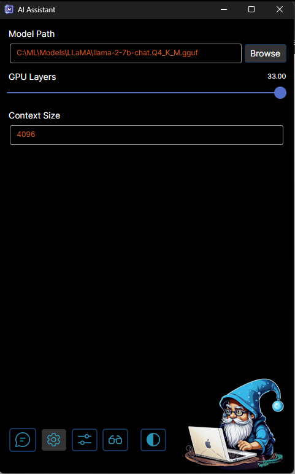

<div align="center">


# avalonia-ai-assistant
</div>

Avalonia-ai-assistant is a sample AI chat assistant based on Avalonia UI framework and LLamaSharp library. It allows to run most popular AI models locally using a consumer GPU (or CPU only).

## Quick Start

### Step 1 - Build avalonia-ai-assistant application
Run `dotnet build -c Release` command to build CPU version or `dotnet build -c Release_Cuda` if you have CUDA 12 compatible GPU.

### Step 2 - Download GGUF LLM model
Download any LLM model in GGUF format. For example:

#### LLama 2 family
|Model|Link|
|-|-|
|LLama2 7B|https://huggingface.co/TheBloke/Llama-2-7B-Chat-GGUF|
|LLama2 8B Pro Inst|https://huggingface.co/TheBloke/LLaMA-Pro-8B-Instruct-GGUF|
|CodeLLama 7B Inst|https://huggingface.co/TheBloke/CodeLlama-7B-Instruct-GGUF|

#### LLama 3 family
|Model|Link|
|-|-|
|LLama3 8B Inst|https://huggingface.co/QuantFactory/Meta-Llama-3-8B-Instruct-GGUF|

#### Phi 3 family
|Model|Link|
|-|-|
|Phi 3 mini Inst|https://huggingface.co/microsoft/Phi-3-mini-4k-instruct-gguf|
|Phi 3 medium Inst|https://huggingface.co/QuantFactory/Phi-3-medium-4k-instruct-GGUF|

### Step 3 - Setup config
Change `appsettings.json` file to have default setting for the path to the downloaded model. Also setup correct values for the modal max context size and other parameters.
For example for LLama 2 it can be:
```json
"ModelParams": {
    "FileName": "llama-2-7b-chat.Q4_K_M.gguf",
    "Path": "C:\\ML\\Models\\LLaMA\\",
    "GpuLayerCount": "33",
    "TotalLayerCount": "33",
    "ContextSize": "4096",
    "CustomHistoryTransformer": "Llama2"
}
```
Note: do not forget to add `"CustomHistoryTransformer": "Llama2"` attribute for any LLama 2 family model (remove it for different types of models).

### Step 4 - Run application

After running avalon-ai-assistant application configure Options and Settings tabs in UI. 

 

Start new chat session and enjoy!

## Demo

 

## License

Avalonia-ai-assistant is released under the MIT License. See the [LICENSE](https://github.com/asmirnov82/avalonia-ai-assistant/tree/main/LICENSE) file for details.
